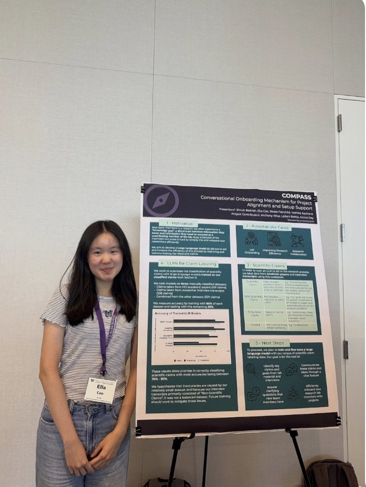
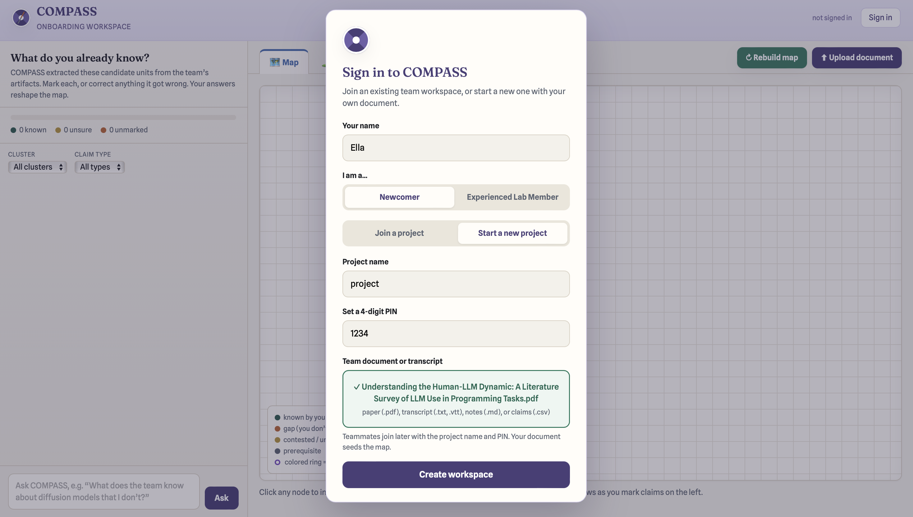
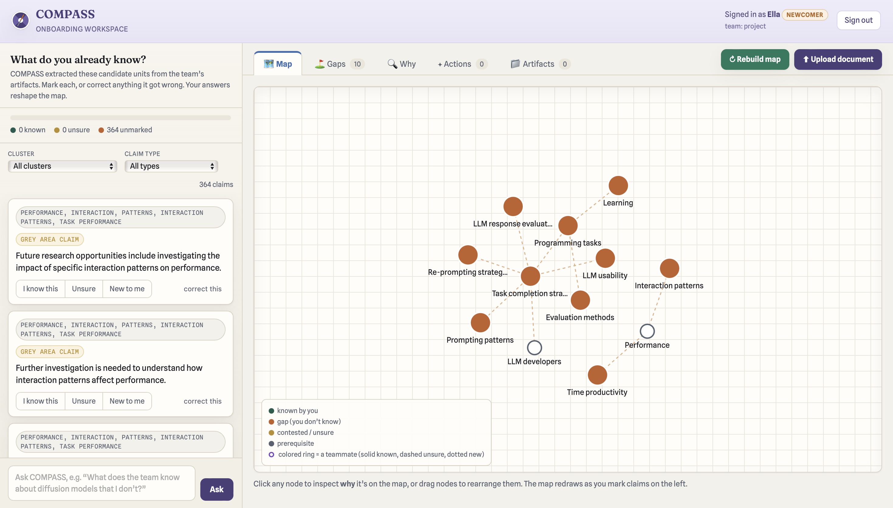
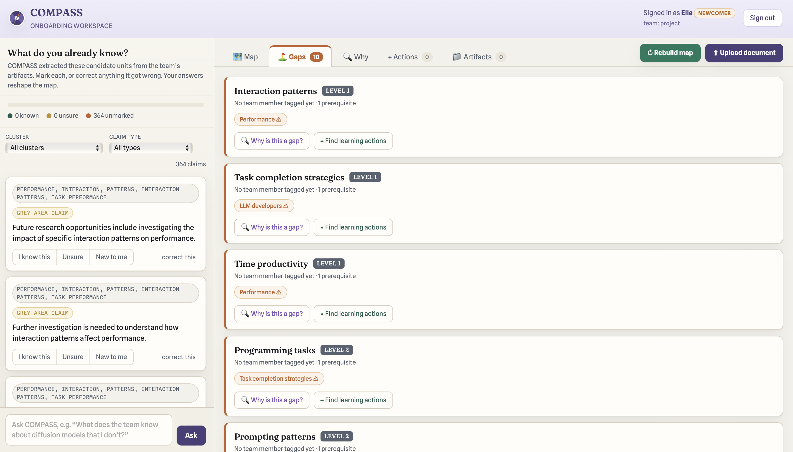
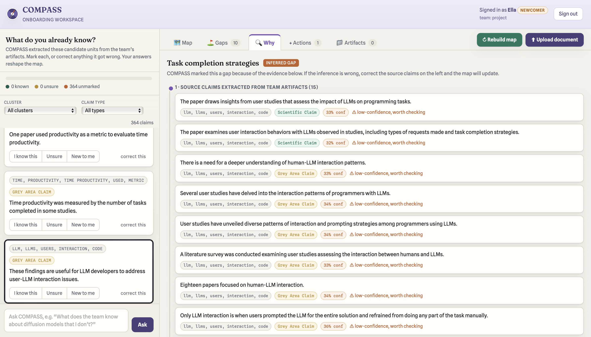
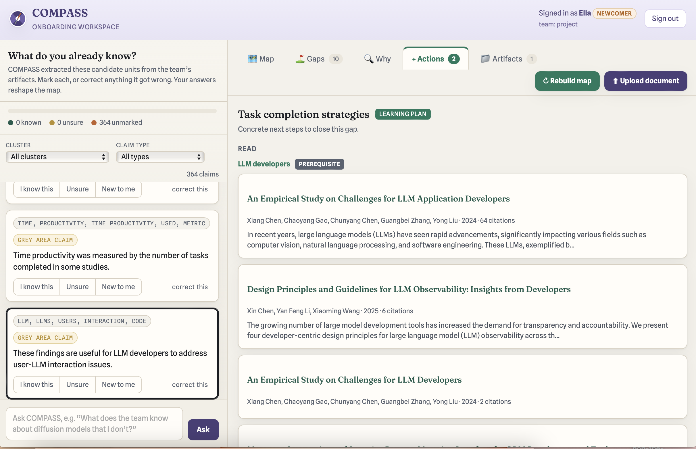
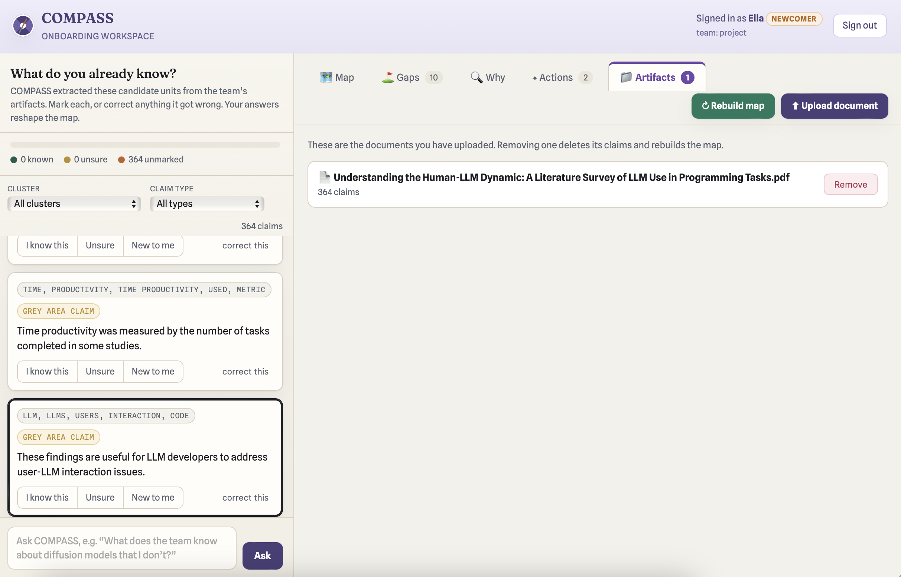

# Knowledge-Gap-Detection-Engine
An ML system that automates knowledge gap detection for research team onboarding. This is part of ongoing research project, and code/logic cannot be disclosed.

Link (if doesn't work scroll down for screenshots): http://playfair.cs.washington.edu:8590

Process:

1. The engine turns a research team's scattered artifacts (meeting transcripts, notes, papers) into a negotiable onboarding map.
2. The system proposes candidate knowledge units and lets the newcomer mark what they know, correct what the system misread, and trace every inferred gap back to the source text that produced it.
3. The output is a living knowledge graph that surfaces contested, missing, and prerequisite knowledge.
4. Then converts gaps into concrete learning actions.

---

## Screenshots

**Sign in / create a workspace.** 

**The map.** 

**Gaps.** 

**Why is this a gap.** 

**Actions.** 

**Artifacts.** 

